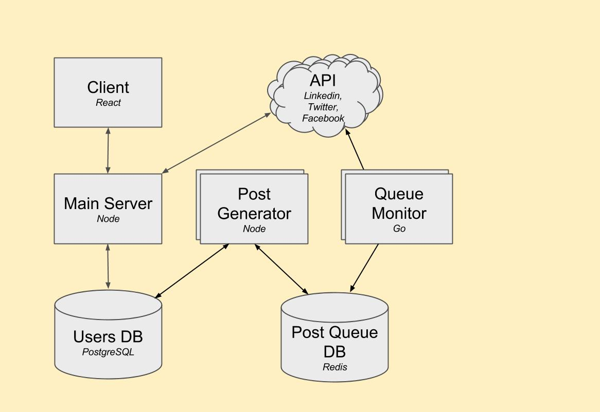

## Description
ImPostr is intended to be an automation-as-a-service for curating one's online presence.  Connecting Facebook, LinkedIn, and/or Twitter will allow the application to define relevant content and post said content on each of these networks.  There is anxiety associated with maintaining your online persona and ImPostr is intended to handle this for you.  You can also define specific posts, cancel generated posts, and view previous activity from the application.  Give it a whirl!

## Table of Contents

1. [Usage](#usage)
1. [Screenshots](#screenshots)
1. [Getting Started](#getting-started)
    1. [Prerequisites](#prerequisites)
    1. [Installing Dependencies](#installing-dependencies)
1. [Understanding the Code Base](#understanding-the-code-base)
    1. [File Structure](#file-structure)
    1. [Where to Begin](#where-to-begin)
1. [The Tech Stack](#tech-stack)
1. [Core Team](#core-team)
1. [Contributing](#contributing)
1. [Licensing](#license)

### Prerequisites

Install [Node](https://nodejs.org/en/) and [PostgreSQL](https://www.postgresql.org/download/) in your development environment; the optional [worker service](https://github.com/HypnoticAlpaca/microservice) is written in [Go](https://golang.org/), which will also require configuration.

Specifically, you will need specific developer keys for Twitter, LinkedIn, and Facebook.

1. [Facebook](https://developers.facebook.com/docs/facebook-login/access-tokens/)
1. [LinkedIn](https://developer.linkedin.com/docs/oauth2)
1. [Twitter](https://dev.twitter.com/oauth/overview)

Environment variables are preferred for app-specific credentials and database endpoint(s).  As an example, the current project has a configuration file with defaults (in case environment variables are not set) in 'server/config'.  The following are required for a fully functional application: database endpoint, database credentials, Facebook APP ID, Facebook APP Secret, LinkedIn Key, LinkedIn Secret, Twitter Consumer Key, and Twitter Consumer Secret.

As always, the [Airbnb Style Guide](https://github.com/airbnb/javascript) is preferred.
You may configure your linter of choice; for us, Sublime Text with ESLinter was sufficient.  Dan Abramov's [guide](https://medium.com/@dan_abramov/lint-like-it-s-2015-6987d44c5b48#.ne1ikvdg9) may be useful.

### Installing Dependencies <EDIT>

From the root directory, we'll use NPM to handle dependency installation.
```sh
npm i
```

### Running The App (cloned from git)

The use of Node scripts are ideal for persistent Babel compilation and Node server listening.  Personally, we simply bound the following to "npm run dev" (with the aid of [Nodemon](https://github.com/remy/nodemon)):

```sh
webpack -d --watch & nodemon server/server.js
```
### Running the Application (Docker)

Alternatively, you may find the deployed image here:

```sh
docker pull stevenchung/impostor:latest
```
#### Architecture

<p align="center">
  
</p>

#### Database Design

<p align="center">
  
</p>

## Testing

Current testing coverage is ~85%.

From the root directory, run the following script

```sh
npm test
```

Tools user for testing:
- Mocha
- Chai
- Sinon
- Chai-As-Promised

## Tech Stack

- Node/Express
- Go
- PostgreSQL
- React, Redux
- Docker / AWS (EC2)

## Core Team

  - [Justin Ross](https://github.com/JustinTRoss)
  - [Steven Chung](https://github.com/StevenChung)
  - [Matt Dubie](https://github.com/mdubie)

## Contributing

1. Fork the repo.
1. Clone it to your local computer
1. Cut a namespaced feature branch from master
1. Make commits and prefix each commit with the type of work you were doing
1. Before you push, rebase upstream changes into your branch, fix any potential conflicts, and then push to your fork.
1. Submit a pull request directly to the master from your feature branch
1. Someone else will perform code review to keep codebase clean
1. Fix any errors or issues raised by the reviewer and push the fixes as a single new commit
1. Repeat until the pull request is merged.

## License

M.I.T
